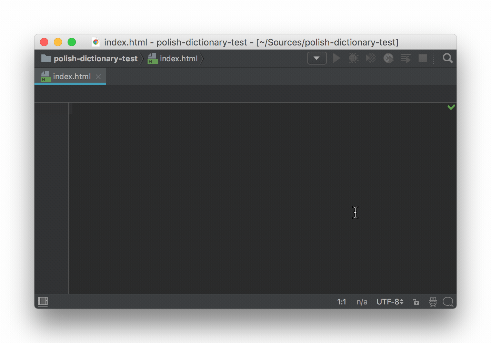
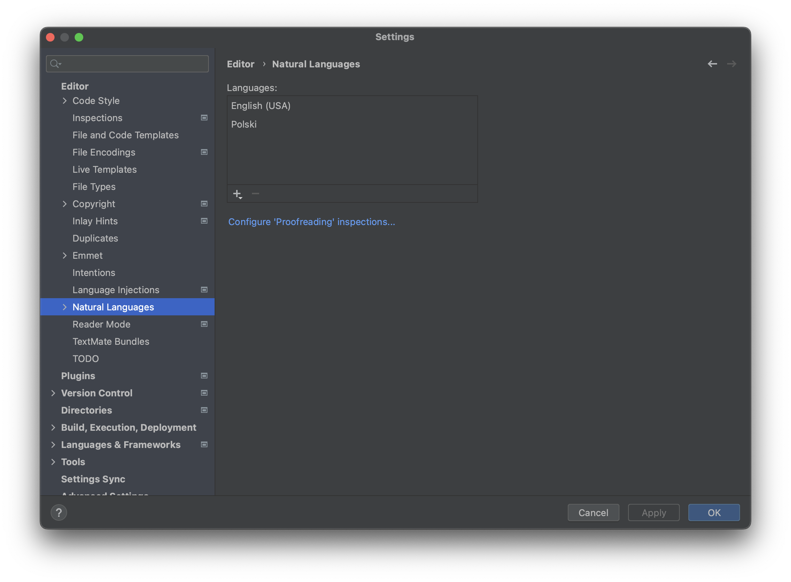

[Why deprecated? How can I get spellchecking?](#deprecated)


# JetBrains Polish dictionary

Polish dictionary for JetBrains' IDEs.

[The dictionary](http://www.sjp.pl/slownik/en/) contains more than 3 400 000 Polish words and is licensed under GPL, LGPL, MPL, CC SA and Apache.




## Deprecated

This repository is not anymore needed for Polish (or others) dictionaries. JetBrains added builtin support for spellchecking. And do it better. You can download dictionaries via `Settings -> Editor -> Natural Languages`. [Read more](https://www.jetbrains.com/help/webstorm/proofreading.html) (other JetBrains IDEs works same way).

You can however take a look [how extract `aspell` dictionary](/make.sh) - for other purposes, as plain txt file, one word per line.




## Compatibility

Dictionary should work for all JetBrains' IDEs. Tested on PyCharm and WebStorm.


## How to use

1. Download the [package with dictionary](https://github.com/sigo/jetbrains-polish-dictionary/archive/master.zip) (about 10MiB).
2. Extract downloaded file.
3. Open **Default settings** and/or **Settings** (for current project) in your JetBrains' IDE.
4. Select **Editor**.
5. Select **Spelling**.
6. Change tab to **Dictionary**.
7. Select **+** button.
8. Select the directory with downloaded dictionary.
9. Apply settings.

If spell checking doesn't work, restart your IDE.

**Note:** IDE will use the extracted directory, so don't delete it.

**Note 2:** If you want possibility to pull changes, you need clone the repository instead of downloading the zip file.


## Requirements for generating dictionary

- bash
- aspell
- aspell-pl


## Regenerate dictionary

```shell
./make.sh
```
